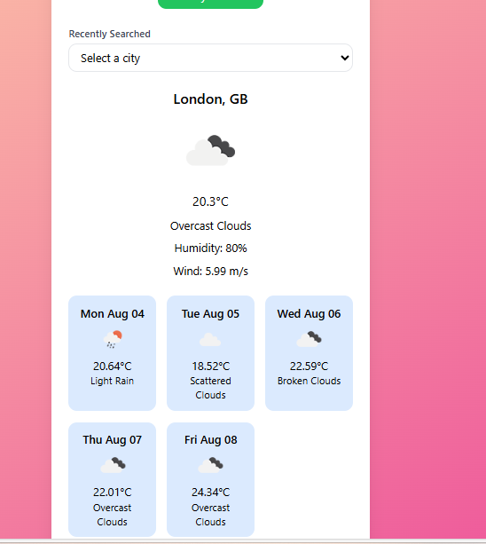

# weather-forecast-application


# 🌦️ Weather Forecast Application

This is a responsive weather forecast web application built using **HTML**, **Tailwind CSS**, and **JavaScript**. It retrieves real-time weather data using the **OpenWeatherMap API** and displays both current weather conditions and a 5-day forecast.

---

## Features

-  Search weather by city name
-  Get weather forecast for current location using geolocation
-  View 5-day forecast with date, icons, temperature, humidity, and wind speed
-  Recent city search history saved using localStorage
-  Error handling for invalid cities or connection issues
-  Fully responsive design (mobile, tablet, and desktop)

---

## Tech Stack

- HTML5
- Tailwind CSS (via CDN)
- JavaScript
- OpenWeatherMap API

---


## 🚀 Getting Started

### 1. Clone the repository

```bash
git clone https://github.com/your-username/weather-forecast-app.git
cd weather-forecast-application
2. Open index.html in your browser
You can run it locally using Live Server or just by double-clicking index.html.

 API Key Setup
Sign up at https://openweathermap.org/api

Get your free API key

In script.js, replace:

const apiKey = "your_actual_key_here";
Project Structure
bash
Copy
Edit
weather-forecast-app/
├── index.html         # Main HTML file
├── script.js             # JavaScript logic         # (Optional) custom styles
├── README.md          # Project documentation

Usage Tips
Use clear city names like "London", "Paris", "Hyderabad"

Ensure your API key is valid and not expired

Geolocation feature may require browser permission

Screenshots:




Author : Boppudi Indu Sri